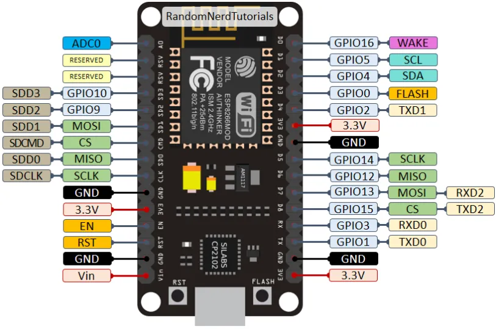

# X-Lights Workshop

Learn programming with WS2812 ligthts and microcontroller!

# Prerequisites

## Hardware

- ESP32 or ESP2812 (other microcontrollers such as Arduino or STM32 should work too)
- solderless breadboard
- DC power source 5V (up to 12V can be used to power the lights, but NOT the ESP, which has to be powered via USB in such a case!)

(optionally)
- 1 mF capacitor
- 470 rezistor

## Software

on the computer:

GUI:
- thonny

Command line tools via `pip install` (optionally):

- esptool
- adafruit-ampy
- picom

## Microcontroller

[Micropython][micropython] for your version of micronotroller.

[micropython]: https://micropython.org/download/

# Procedure

## GUI

(Mario)

## Command line

Connect the microcontroller to your computer via data-USB cable. In the GNU/Linux it should appear as a port addressable by /dev/ttyUSB0.

To be in the same starting situation, we erase all the flash memory as
```
esptool.py --port /dev/ttyUSB0 erase_flash
```
Then we can upload the micropython firmware downloaded (e.g. espXXXX.bin) using:
```
esptool.py --chip esp32 --port /dev/ttyUSB0 write_flash -z 0x1000 espXXXX.bin
```

To get the micropython command line prompt we can use picocom
```
picocom /dev/ttyUSB0 --baud 115200
```

To upload, download, run code or act on the micro-Python file system run ampy, e.g.
```
ampy --port /dev/ttyUSB0 --baud 115200 put color.py
ampy --port /dev/ttyUSB0 --baud 115200 run ws2812.py
```
The boot.py or main.py will be run on the startup.


## Hello Lights

IMPORTANT: Make sure the ground (GND) of the microcontroler and the lights are interconnected. Otherwise, the signal won't get through properly and the lights will be incontrollable.

To start with the lights we follow [the manual][upy]. According this manual the lights use the Machine pin 0, which can be found in ESP2812 pinout image to be D3.



[upy]: https://docs.micropython.org/en/latest/esp32/quickref.html#neopixel-driver

```
from machine import Pin
from neopixel import NeoPixel

N = 50                  # number of LED in the chain
pin = Pin(0, Pin.OUT)   # set GPIO0 to output to drive NeoPixels
np = NeoPixel(pin, N)   # create NeoPixel driver on GPIO0 for 8 pixels
np[0] = (255, 255, 255) # set the first pixel to white
np.write()              # write data to all pixels
r, g, b = np[0]         # get first pixel colour
```
After running the code you can see that the LED number 0 (i.e. the first one) is turned on white. This is because `np[0]` represents the first pixel of the variable `np` (number 0).

Actually every LED is composed of three colors that have intensity between 0 and 255 (i.e. codified by 8 bits). The line `np[0] = (255,255,255)` encodes the maximal intensity in order of (green, red, blue) colors.

## Turn on All

Now lets setup a color of the whole chain to be pink, which is encoded as `pink = (0,255,50)`. 
